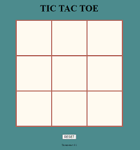
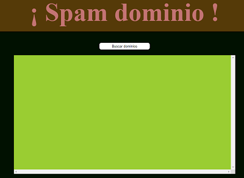
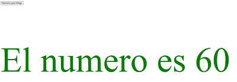
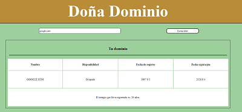
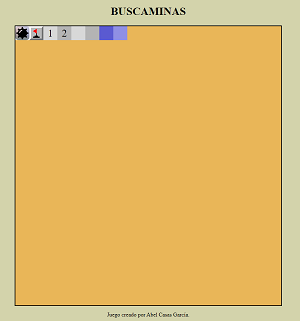

# JavaScript

This is a repository in which i will save all the exercises and projects we did for JS subject. I understand that they may look a little bit "ugly" but please, I am not a profesional designer... I am just trying my best and they are fully functional.

* [TicTacToe](#tictactoe)
* [SpamDominio](#spamdominio)
* [RandomNumber](#randomnumber)
* [DonaDominio](#donadominio)
* [BuscaMinas](#buscaminas)
* [BlackJackImpostor](#blackjackimpostor)

## TicTacToe

[Here](./projects/tictactoe/) you will find a first aproachment to the popular game called tic-tac-toe. It is not perfectly done, but it is randomnly played by the machine so... if you are bored, i invite you to try to win!!

## SpamDominio

[Here](./projects/spamdominio/) you will find the first "program" that we learnt to understand how petitions get works, and how can we interact with JavaScript and Data without making anychanges at the html, making the web page more dinamic.

It consist in a button, that make NXN petitions to find which domains of web pages are free or taken. Just searching for a pre-defined string that starts with "a" and ends with "ib.com".

## RandomNumber

[Here](./projects/random-number/) is located the exercise that consisted in creating a virtual machine, convert it into a apache server and conecting this program to it. So we could get a random number from 1 to 99, if it is bigger than 50, it will appear in green else in red.

It was our first look about the full cicle of web development.

PD: Just working if there is a working ip returning a number from 1 to 99.

## DonaDominio

[Here](./projects/donadominio/) you will a replication of a web domain search. It just work with domains that ends with ".com". It sends a petition get to a web that allow us to check if it is able or not. Also gives the date of register, when will it expire and how long have it been registered in years.

## BuscaMinas

(NOT FINISH)

[Here](./projects/buscaminas/) is a replication of the popular game called "buscaminas", which consist of finding all the empty places in a border and not "exploting" trying it.

## BlackJackImpostor

(NOT FINISH)

[Here](./projects/blackjack-impostor/) you will find an impostor blackjack game, but with dice.
